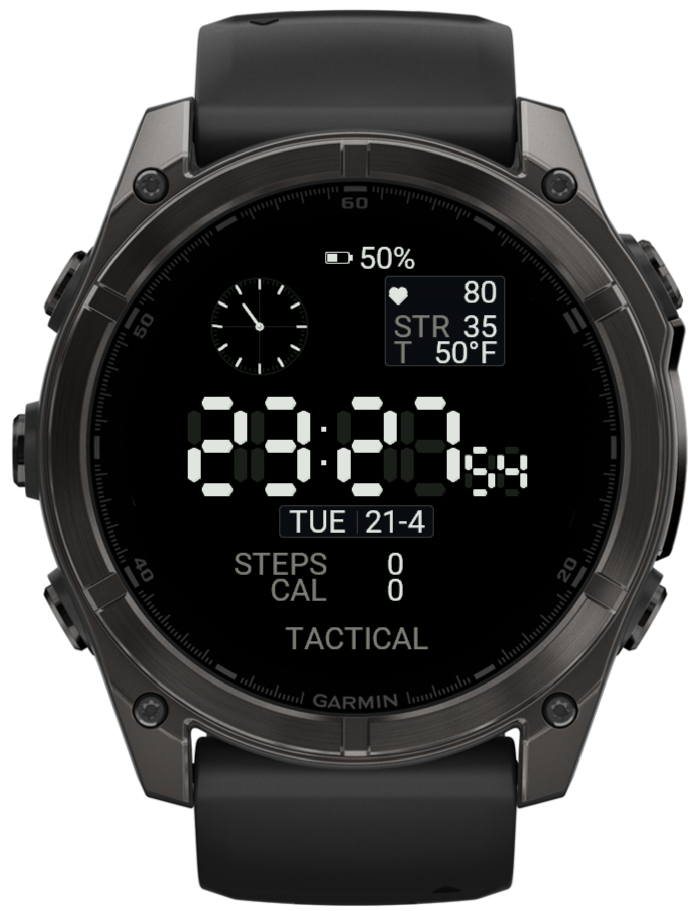

# Tactical Minimalist Watch Face for Garmin Fenix 8

A retro-tactical digital watch face for the **Garmin Fenix 8 AMOLED** (47mm / 51mm), inspired by classic Casio G-Shock and military field watches. Built with Connect IQ / Monkey C.



## Features

- **Bold 7-segment LCD display** with tapered segment polygons and ghost inactive segments
- **Analog radar sub-dial** with seconds sweep, crosshair, and tick ring
- **Health monitoring panel** — heart rate, stress level, outside temperature (Fahrenheit)
- **Activity tracking** — step counter and calorie burn with thousands separator
- **Battery indicator** with icon and percentage
- **Day and date display** in bordered panel
- **Always-On Display (AOD)** mode with dimmed green segments on black
- **Zero bitmap resources** — all graphics rendered procedurally for minimal memory footprint

## Target Device

- Garmin Fenix 8 47mm / 51mm AMOLED (`fenix847mm`)
- Min Connect IQ API: 6.0.0
- Display: 454 x 454 round AMOLED

## Screenshots

| Active Mode | AOD Mode |
|---|---|
| Full display with radar, health stats, time, steps, calories, battery | Dimmed HH:MM:SS with day/date only |

## Installation

### From source (developers)

1. Install [Connect IQ SDK](https://developer.garmin.com/connect-iq/overview/) and set up your dev key
2. Clone this repo
3. Build:
   ```bash
   monkeyc -d fenix847mm -f monkey.jungle -o bin/TacticalMinimalist.prg \
           -y ~/.Garmin/ConnectIQ/developer_key
   ```
4. Sideload to your watch via [OpenMTP](https://openmtp.ganeshrvel.com/) (macOS) or USB Mass Storage (Windows):
   - Copy the `.prg` file to `GARMIN/Apps/` on your watch

### Pre-built binary

Download the latest `.prg` from the [Releases](../../releases) page and copy it to your watch's `GARMIN/Apps/` folder.

## Layout

```
        [battery icon] 50%
  (radar)       [heart] 80
                STR     35
                T     55°F

          23:08:14

        [TUE | 21-4]

       STEPS      12,450
       CAL         1,250

          TACTICAL
```

## Complications

| Complication | Source |
|---|---|
| Heart Rate | `ActivityMonitor.getHeartRateHistory()` |
| Stress | `SensorHistory.getStressHistory()` |
| Temperature | `Weather.getCurrentConditions()` (phone sync, Fahrenheit) |
| Steps | `ActivityMonitor.getInfo().steps` |
| Calories | `ActivityMonitor.getInfo().calories` |
| Battery | `System.getSystemStats().battery` |

## Tech Stack

- **Language**: Monkey C (Connect IQ)
- **Rendering**: 100% procedural — no bitmap fonts, no image resources
- **7-segment engine**: Custom polygon renderer with tapered hexagonal segments and ghost traces
- **Memory**: ~108 KB (well under 128 KB watch face limit)

## Project Structure

```
source/
  App.mc          — Application entry point
  View.mc         — Watch face renderer (active + AOD)
resources/
  drawables/      — Launcher icon only
  strings/        — App name
  layouts/        — Empty (all rendering is imperative)
manifest.xml      — App manifest targeting fenix847mm
monkey.jungle     — Build configuration
tools/
  DSEG7Classic-Bold.ttf  — Reference font (not used in build)
```

## License

MIT License — free to use, modify, and distribute.

## Keywords

Garmin Fenix 8 watch face, tactical watch face, military digital watch, Casio G-Shock style, Connect IQ, Monkey C, AMOLED watch face, 7-segment display, retro digital, tactical minimalist, Garmin custom watch face, free Garmin watch face
